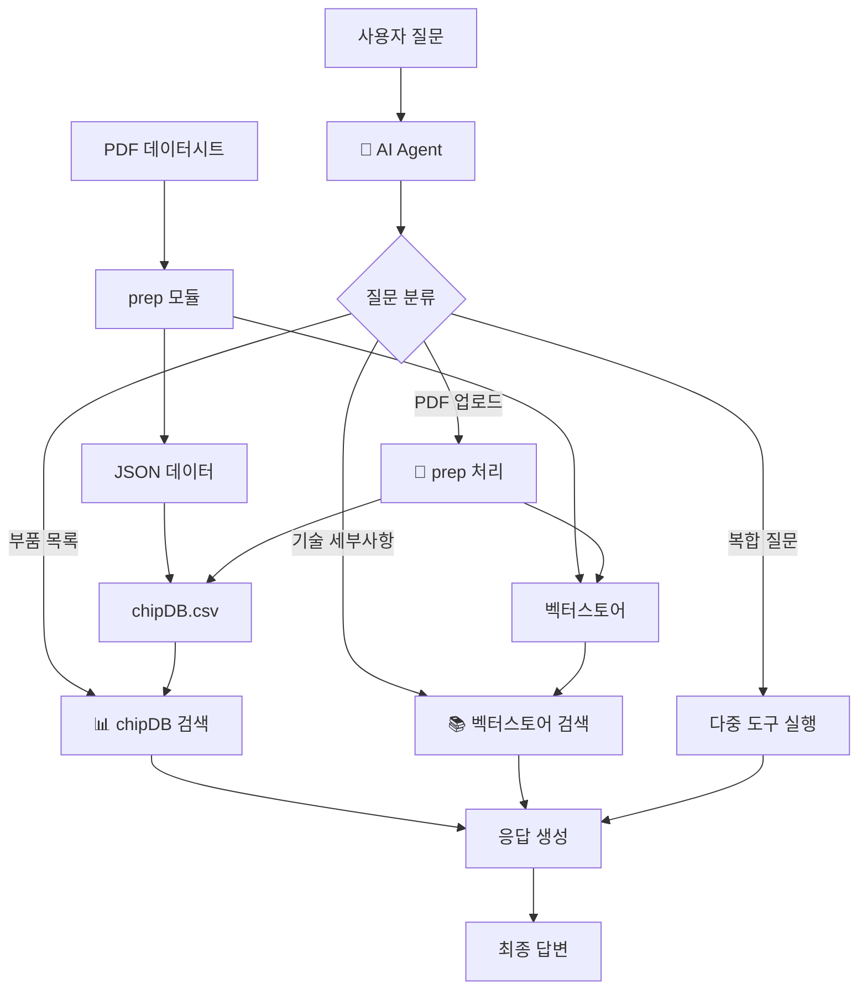
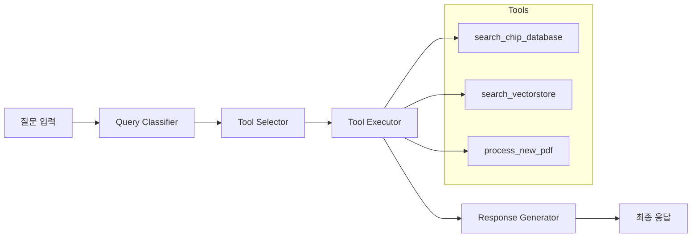

# ChipChat 시스템 구조

## 전체 아키텍처

## AI Agent 워크플로우

## 3가지 핵심 도구

### 1. ChipDB 검색 (search_chip_database)
- **목적**: 부품 목록 및 기본 사양 검색
- **데이터**: chipDB.csv (part number, grade, maker_pn, spec)
- **사용 예**: "전압 변환기 기능 부품들 알려줘"

### 2. 벡터스토어 검색 (search_vectorstore)  
- **목적**: 상세 기술 문서 검색
- **데이터**: FAISS 벡터스토어 (prep 모듈로 생성)
- **사용 예**: "W25Q32JV의 전기적 특성은?"

### 3. PDF 처리 (process_new_pdf)
- **목적**: 새 데이터시트 업로드 및 통합
- **처리**: prep 파이프라인 → 벡터스토어 추가 → chipDB 업데이트
- **사용 예**: 새 PDF 파일 업로드

## 질문 유형별 처리

| 질문 유형 | 사용 도구 | 예시 |
|-----------|-----------|------|
| COMPONENT_LIST | chipDB 검색 | "로직 게이트 부품들 리스트업해줘" |
| TECHNICAL_DETAIL | 벡터스토어 검색 | "LM324 동작 전압 범위는?" |
| PDF_UPLOAD | PDF 처리 | 파일 업로드 |
| HYBRID | 다중 도구 | "32Mbit 메모리 찾고 상세 스펙도 알려줘" | 